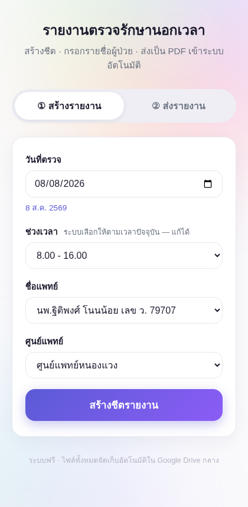
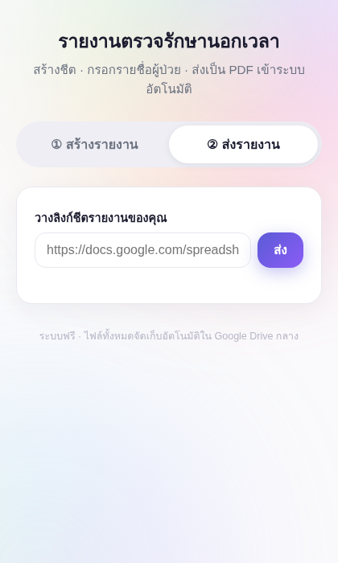

# รายงานตรวจรักษานอกเวลา — Sheet → PDF → Drive

A free, zero-server web app for hospital after-hours treatment reports (เอกสารรายงานตรวจรักษานอกเวลา). Doctors create a pre-filled Google Sheet, add patient rows, paste the link back, and the app converts it to PDF and files it automatically in a central Google Drive — organised by month → medical center.

Built entirely on **Google Apps Script** — no server, no database, no cost.

| ① Create | ② Submit |
|---|---|
|  |  |

## How it works

```
Doctor                          App (Apps Script Web App)              Google Drive
──────                          ─────────────────────────              ────────────
pick date / doctor / center ──▶ copies TEMPLATE, pre-fills header ──▶  Pending/
                                shares "anyone with link can edit"
fills patient rows in the sheet
pastes sheet link, hits ส่ง ──▶ exports PDF (range A1:E, no blank
                                rows), files it, archives the sheet ─▶ PDF/{month}/{center}/
                                                                       Archive/  (view-only)
```

- **Date & time auto-picked** from the current clock (3 slots: `8.00 - 12.00`, `8.00 - 16.00`, `16.00 - 20.00`) — always editable.
- **Doctor & center dropdowns** live in a Config sheet — no code edits to add people.
- **Permission guard:** if a pasted sheet isn't shared, the app tells the user to open link-sharing and resubmit (sheets created by the app are shared automatically).
- **Audit trail:** every report is logged in a Registry sheet with status + PDF link. Duplicate submissions return the existing PDF; re-generated files get `_v2` suffixes, never overwritten.

## Quick start (~5 minutes)

### Option A — copy & paste (no tools needed)

1. Create a folder in Google Drive for the system, copy its ID from the URL.
2. Go to [script.google.com](https://script.google.com) → **New project**.
3. Paste `src/Code.js` into `Code.gs`, set `ROOT_FOLDER_ID` at the top to your folder ID.
4. Add an HTML file named exactly `Index`, paste `src/Index.html`.
5. Select the `setup` function → **Run** → authorize. This auto-creates the template sheet, Registry/Config, and `Pending / Archive / PDF` folders.
6. **Deploy → New deployment → Web app** → Execute as **Me**, access **Anyone** → copy the URL. That URL is the website.

Thai step-by-step guide: [SETUP.md](SETUP.md)

### Option B — clasp (for developers)

```bash
npm i -g @google/clasp
clasp login
clasp create --type webapp --title "รายงานตรวจรักษานอกเวลา" --rootDir src
# or: cp .clasp.json.example .clasp.json and set your scriptId
clasp push
```

Then set `ROOT_FOLDER_ID`, run `setup` once in the editor, and deploy as a web app (same as steps 5–6 above).

## Configuration (no code)

Everything editable lives in the **`ระบบรายงาน — Registry`** spreadsheet created by `setup()`:

| Tab | Purpose |
|---|---|
| `Config` | columns `doctors`, `centers`, `timeslots` — the dropdown contents |
| `Registry` | full submission history: sheet ID, date, doctor, center, status, PDF URL |

## Project structure

```
src/
  Code.js          # backend: setup, create, submit, PDF export, Drive filing
  Index.html       # single-page UI (Thai, mobile-first)
  appsscript.json  # Asia/Bangkok timezone, web app config
SETUP.md           # Thai installation guide
docs/              # screenshots
```

## Security notes

Pending sheets are shared as *anyone with link can edit* and contain patient data (name / HN / diagnosis). Links should stay within the care team. The app locks sheets to view-only and moves them to `Archive/` the moment the PDF is generated. If your organisation requires account-restricted sharing, change `setSharing` in `createReport` — the trade-off is every doctor then needs a Google account.

## License

[MIT](LICENSE)
